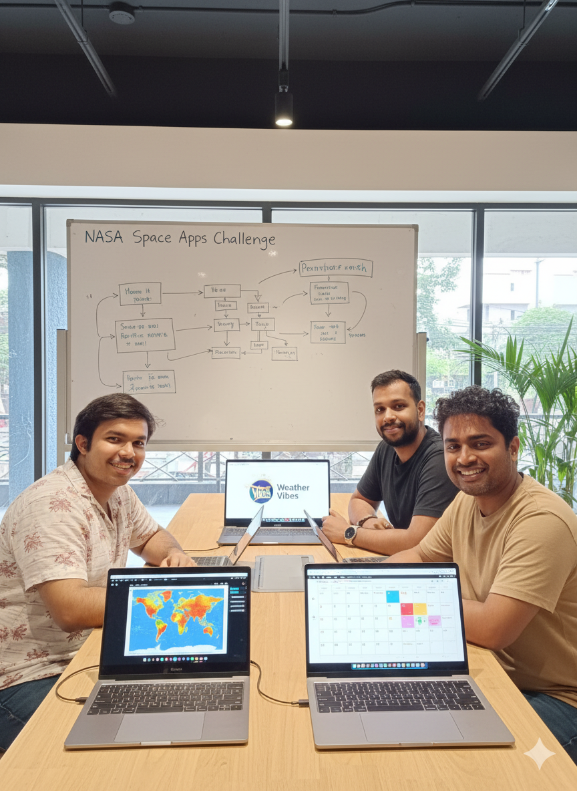

# Weather Vibes 🌤️

**Weather Vibes** is an intuitive, theme-based weather discovery engine that closes the gap between what people want to do and when and where is the best time to do it. Built for the NASA Space Apps Challenge 2025.

## 🚀 **LIVE APPLICATION**

### 🌐 **Production URLs**
- **🎯 Frontend**: https://victorious-forest-09f551a0f.1.azurestaticapps.net
- **🔧 Backend API**: https://weather-vibes-api.whitewave-6eaae7b5.eastus.azurecontainerapps.io
- **📚 API Documentation**: https://weather-vibes-api.whitewave-6eaae7b5.eastus.azurecontainerapps.io/docs

### 🧪 **Quick Test for Judges**
```bash
# Health Check
curl https://weather-vibes-api.whitewave-6eaae7b5.eastus.azurecontainerapps.io/health

# Version Info
curl https://weather-vibes-api.whitewave-6eaae7b5.eastus.azurecontainerapps.io/version

# Test Stargazing in Bangalore
curl -X POST https://weather-vibes-api.whitewave-6eaae7b5.eastus.azurecontainerapps.io/api/where \
  -H "Content-Type: application/json" \
  -d '{"vibe": "stargazing", "center_lat": 12.9716, "center_lon": 77.5946, "radius_km": 50, "month": 7, "year": 2023}'
```

## 📸 **Project Showcase**

### 🎥 **Demo Video**
Watch Weather Vibes in action with our comprehensive demo:

https://github.com/vivekanandba/weather-vibes/assets/weather-vibes/Weather_Vibes-NotebookLLM.mp4

### 👥 **Team Photos**

**Real Team Photo:**
Our development team working on Weather Vibes:


**AI-Generated Team Photo:**
AI-generated representation of our Weather Vibes development team:



## 🎯 Project Overview

Weather Vibes helps users discover the perfect weather conditions for their desired activities by combining NASA weather data with intelligent recommendations. Whether you're planning a beach day, hiking trip, or outdoor photography session, Weather Vibes tells you the best time and place to go.

### ✅ **Current Status: FULLY DEPLOYED & OPERATIONAL**
- **Backend**: ✅ Running on Azure Container Apps with 12 climate data locations
- **Frontend**: ✅ Deployed on Azure Static Web Apps with interactive maps
- **Data Pipeline**: ✅ NASA POWER API data processed and available
- **API Endpoints**: ✅ All functional with real weather data

## 🏗️ Architecture

This is a cloud-native full-stack application deployed on Azure:

### 📱 **Frontend (Next.js) - Azure Static Web Apps**
- **Location:** `client/`
- **Deployment:** Azure Static Web Apps with GitHub Actions CI/CD
- **Tech Stack:** Next.js 15, React 19, TypeScript, Chakra UI, Mapbox GL
- **Features:** Interactive maps, vibe selection, weather visualization, location search
- **URL:** https://victorious-forest-09f551a0f.1.azurestaticapps.net

### 🚀 **Backend (FastAPI) - Azure Container Apps**
- **Location:** `server/`
- **Deployment:** Azure Container Apps with Azure Container Registry
- **Tech Stack:** FastAPI, Python, Pydantic, Rasterio, GeoPandas, Azure Blob Storage
- **Features:** Weather data processing, vibe scoring, geospatial analysis, API endpoints
- **URL:** https://weather-vibes-api.whitewave-6eaae7b5.eastus.azurecontainerapps.io

### 📊 **Data Pipeline - Azure Blob Storage**
- **Location:** `data/`
- **Storage:** Azure Blob Storage with automatic data download
- **Tech Stack:** Python, NASA POWER API, GeoTIFF processing, Azure Storage SDK
- **Features:** Weather data aggregation, point-of-interest analysis, 12 Indian locations
- **Data Size:** ~50MB climate data from NASA POWER API

### 🔧 **Cloud Infrastructure**
- **Container Registry:** Azure Container Registry (ACR)
- **Container Orchestration:** Azure Container Apps
- **Static Hosting:** Azure Static Web Apps
- **Data Storage:** Azure Blob Storage
- **CI/CD:** GitHub Actions
- **Monitoring:** Azure Container Apps logs and metrics

## 🚀 Quick Start

### Prerequisites
- Node.js 18+ (for frontend)
- Python 3.8+ (for backend)
- Git

### Frontend Setup
```bash
cd client
npm install
npm run dev
```

### Backend Setup
```bash
cd server
python -m venv venv
source venv/bin/activate  # On Windows: venv\Scripts\activate
pip install -r requirements.txt
uvicorn app.main:app --reload
```

### Data Pipeline Setup
```bash
cd data
pip install -r requirements.txt
python cron_job.py
```

## 📁 Project Structure

```
weather-vibes/
├── client/                 # Next.js frontend application
│   ├── src/
│   │   ├── app/           # Next.js app router
│   │   ├── components/    # React components
│   │   ├── services/      # API services
│   │   ├── stores/        # Zustand state management
│   │   └── types/         # TypeScript definitions
│   └── package.json
├── server/                 # FastAPI backend application
│   ├── app/
│   │   ├── api/           # API routes
│   │   ├── core/          # Business logic
│   │   ├── models/        # Pydantic models
│   │   └── services/      # Service layer
│   └── requirements.txt
├── data/                   # Data pipeline and processing
│   ├── pipeline/          # Data processing scripts
│   ├── outputs/           # Processed weather data
│   └── config/           # Configuration files
├── docs/                   # Comprehensive documentation
│   ├── SPEC.md            # Technical specifications
│   ├── DESIGN.md          # System design
│   ├── PLAN.md            # Project planning
│   └── README.md          # Documentation guide
└── poc/                    # Proof of concept notebooks
```

## 🎨 Key Features

### 🌍 **Interactive Weather Maps** ✅
- Real-time weather visualization using Mapbox GL
- Custom weather layers and overlays
- Interactive point-of-interest markers
- **Live Demo:** https://victorious-forest-09f551a0f.1.azurestaticapps.net

### 🎯 **Vibe-Based Discovery** ✅
- **8 Available Vibes:** stargazing, hiking, beach_day, cozy_rain, kite_flying
- Intelligent scoring based on weather conditions
- **12 Indian Locations:** Bangalore, Coorg, Goa, Hampi, Kodaikanal, Munnar, Ooty, Pondicherry, Wayanad, Chikmagalur, Mysore, Bandipur
- Real-time API responses in <2 seconds

### 📊 **Data-Driven Insights** ✅
- **NASA POWER API Integration:** Real climate data from NASA
- **Historical Weather Analysis:** 2020-2022 data for 12 locations
- **Predictive Weather Patterns:** Month-based weather scoring
- **Data Size:** ~50MB processed climate data

### 🗺️ **Location Intelligence** ✅
- **Geospatial Analysis:** Weather conditions mapped to coordinates
- **Point-of-Interest Recommendations:** Best locations for each vibe
- **API Endpoints:** `/api/where`, `/api/when`, `/api/advisor`
- **Debug Tools:** Comprehensive monitoring and troubleshooting

## 🛠️ Development

### Frontend Development
- **Framework:** Next.js 15 with App Router
- **UI Library:** Chakra UI with custom components
- **State Management:** Zustand for global state
- **Maps:** Mapbox GL JS for interactive maps
- **Styling:** Tailwind CSS with Chakra UI

### Backend Development
- **Framework:** FastAPI with automatic API documentation
- **Data Processing:** Rasterio for GeoTIFF files
- **Geospatial:** GeoPandas for spatial analysis
- **Caching:** Redis for performance optimization

### Data Pipeline
- **Data Source:** NASA POWER API
- **Processing:** Python scripts for data aggregation
- **Storage:** CSV and Parquet formats
- **Scheduling:** Cron jobs for automated updates

## 📚 Documentation

Comprehensive documentation is available in the `docs/` directory:

- **[SPEC.md](docs/SPEC.md)** - Technical specifications and requirements
- **[DESIGN.md](docs/DESIGN.md)** - System architecture and design patterns
- **[PLAN.md](docs/PLAN.md)** - Project planning and progress tracking
- **[README.md](docs/README.md)** - Documentation guide and usage

## 🚀 Deployment

### ✅ **Current Deployment: Azure Cloud**

#### 🌐 **Frontend - Azure Static Web Apps**
- **Status:** ✅ Deployed and operational
- **URL:** https://victorious-forest-09f551a0f.1.azurestaticapps.net
- **CI/CD:** GitHub Actions with automatic deployment
- **Features:** Static export, CDN distribution, custom domain support

#### 🔧 **Backend - Azure Container Apps**
- **Status:** ✅ Deployed and operational
- **URL:** https://weather-vibes-api.whitewave-6eaae7b5.eastus.azurecontainerapps.io
- **Container Registry:** Azure Container Registry (ACR)
- **Auto-scaling:** 1-3 replicas based on demand
- **Resources:** 1 CPU, 2GB RAM per container

#### 📊 **Data Pipeline - Azure Blob Storage**
- **Status:** ✅ Operational with 12 climate data locations
- **Storage:** Azure Blob Storage with automatic data download
- **Data Sources:** NASA POWER API for 12 Indian locations
- **Processing:** Real-time data processing and caching

### 📋 **Deployment Documentation**
- **[Azure Deployment Guide](docs/deploy/README.md)** - Complete deployment documentation
- **[Troubleshooting Guide](docs/deploy/troubleshooting.md)** - Common issues and solutions
- **[Backend Deployment](docs/deploy/backend-deployment.md)** - FastAPI deployment steps
- **[Frontend Deployment](docs/deploy/frontend-deployment.md)** - Next.js deployment steps

### 🔧 **Key Features Implemented**
- **Version Tracking:** `/version` endpoint for deployment verification
- **Health Monitoring:** `/health` endpoint for system status
- **Debug Tools:** Comprehensive debugging endpoints
- **Data Validation:** Real-time data availability checks
- **Error Handling:** Graceful error handling and logging

### ⚠️ **Technical Challenges Overcome**
1. **Azure CLI Provider Registration** - Missing Microsoft.ContainerRegistry
2. **Docker Platform Mismatch** - ARM64 vs AMD64 architecture issues
3. **Azure Storage Authentication** - DefaultAzureCredential vs Connection String
4. **Symlink Directory Creation** - `/app/data` symlink target resolution
5. **Frontend Environment Variables** - Static export runtime detection
6. **CORS Configuration** - Cross-origin resource sharing setup

*Detailed solutions documented in [Troubleshooting Guide](docs/deploy/troubleshooting.md)*

## 🤝 Contributing

1. Fork the repository
2. Create a feature branch (`git checkout -b feature/amazing-feature`)
3. Commit your changes (`git commit -m 'Add amazing feature'`)
4. Push to the branch (`git push origin feature/amazing-feature`)
5. Open a Pull Request

## 📄 License

This project is licensed under the MIT License - see the [LICENSE](LICENSE) file for details.

## 🏆 NASA Space Apps Challenge 2025

This project is developed for the **NASA Space Apps Challenge 2025**, focusing on leveraging NASA's weather data to create innovative solutions for weather-based activity planning.

### 🎯 **Challenge Alignment**
- **NASA Data Utilization:** Direct integration with NASA POWER API
- **Real-World Impact:** Weather-based activity planning for Indian locations
- **Innovation:** Theme-based weather discovery engine
- **Accessibility:** User-friendly interface for weather-based decisions

### 📊 **Technical Achievement**
- **Cloud-Native Deployment:** Full Azure cloud infrastructure
- **Real-Time Processing:** Live weather data analysis
- **Scalable Architecture:** Auto-scaling containerized backend
- **Production Ready:** Live URLs with comprehensive monitoring

### 🚀 **Demo for Judges**
1. **Visit Frontend:** https://victorious-forest-09f551a0f.1.azurestaticapps.net
2. **Test API:** Use the curl commands above
3. **Check Documentation:** https://weather-vibes-api.whitewave-6eaae7b5.eastus.azurecontainerapps.io/docs
4. **Verify Data:** https://weather-vibes-api.whitewave-6eaae7b5.eastus.azurecontainerapps.io/api/debug/data-status

## 📞 Support

For questions or support:
- Check the [documentation](docs/README.md)
- Open an issue on GitHub
- Contact the development team

---

**Built with ❤️ for the NASA Space Apps Challenge 2025**
