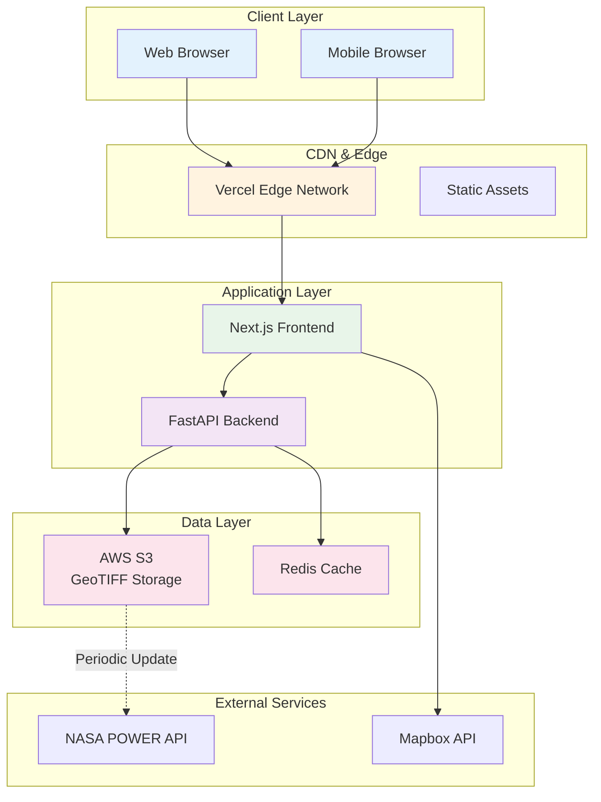
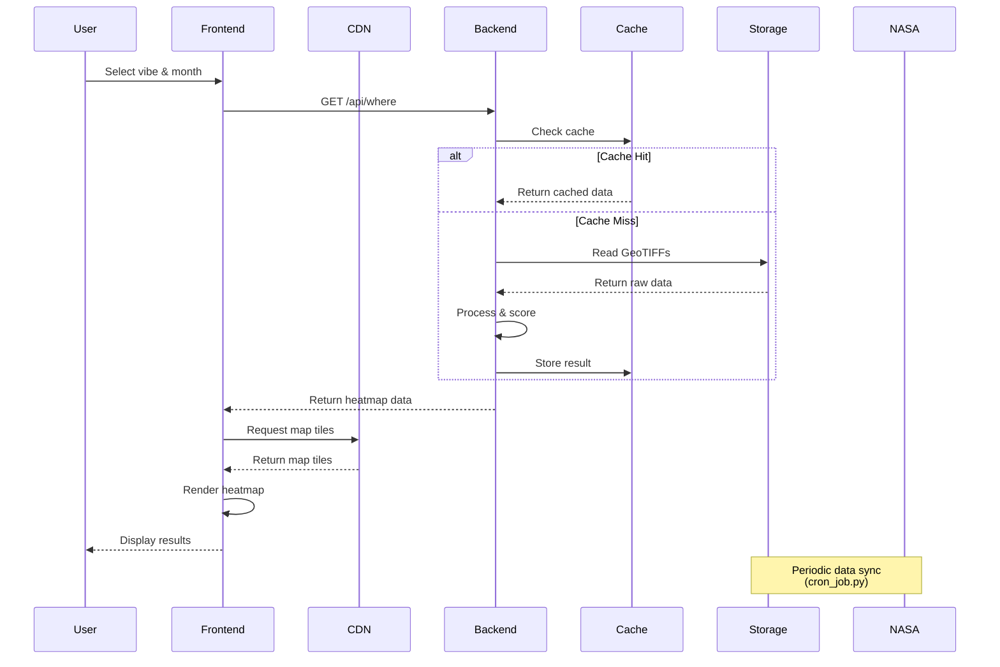
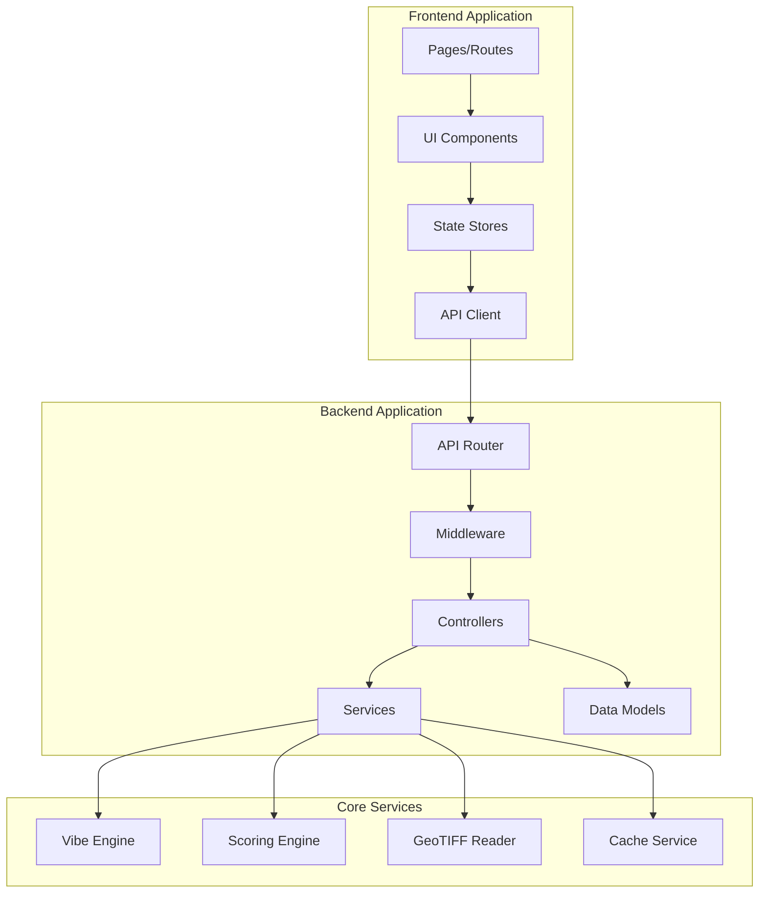
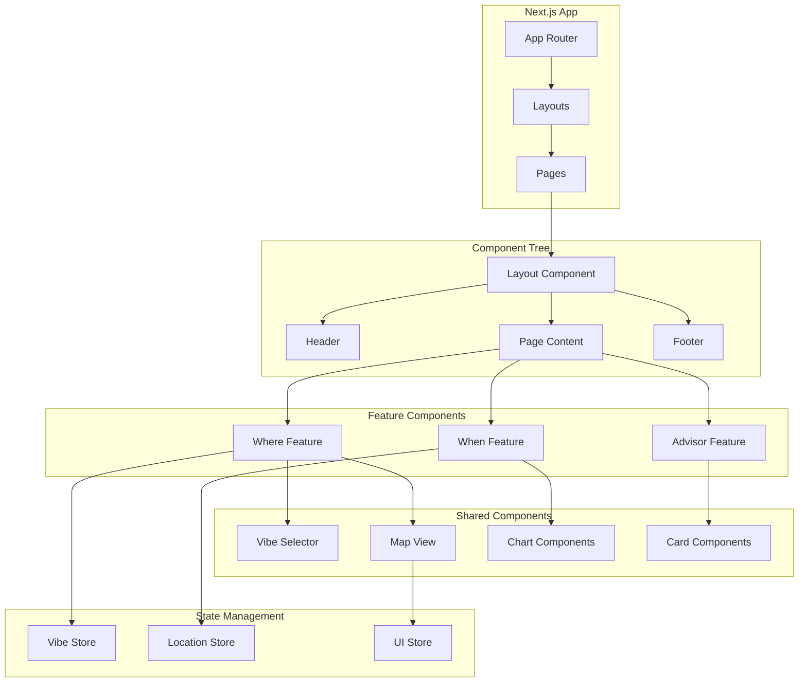
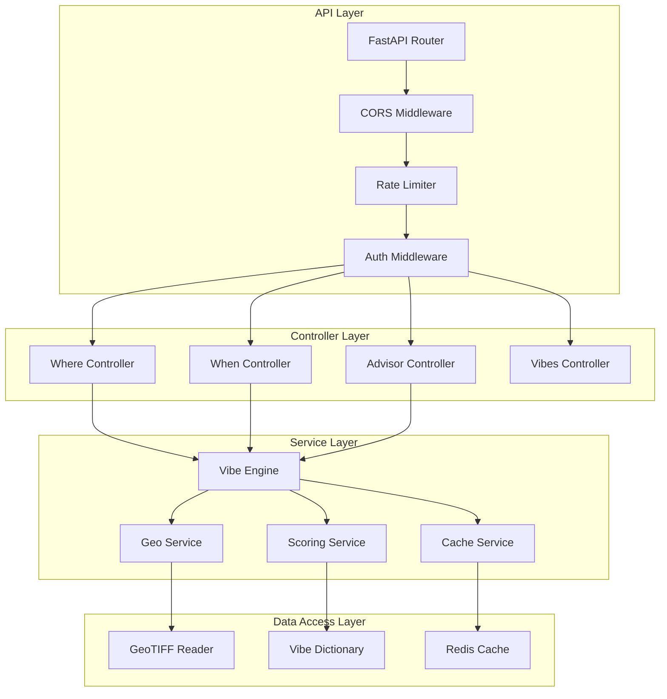
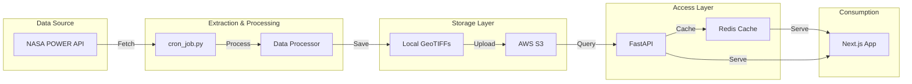
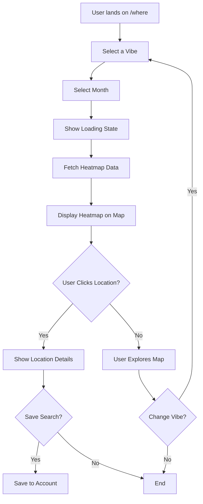
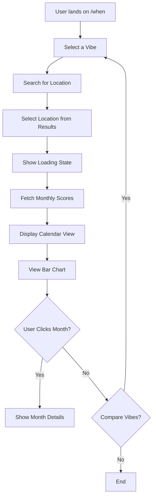
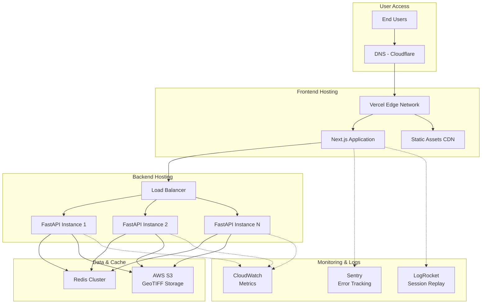
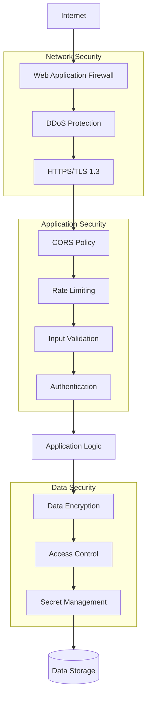

# Weather Vibes - Design Document

**Project:** Weather Vibes - Theme-Based Weather Discovery Engine  
**Team:** Vibe Finders  
**Version:** 1.0  
**Last Updated:** October 4, 2025

---

## Table of Contents

1. [Design Overview](#1-design-overview)
2. [High-Level Architecture](#2-high-level-architecture)
3. [System Architecture](#3-system-architecture)
4. [Frontend Design](#4-frontend-design)
5. [Backend Design](#5-backend-design)
6. [Data Architecture](#6-data-architecture)
7. [Algorithm Design](#7-algorithm-design)
8. [UI/UX Design](#8-uiux-design)
9. [Deployment Architecture](#9-deployment-architecture)
10. [Security Architecture](#10-security-architecture)

---

## 1. Design Overview

### 1.1 Design Principles

**1. Simplicity First**
- Complex climate data translated into simple "vibes"
- Intuitive interface requiring minimal learning curve
- Clear visual hierarchies and consistent patterns

**2. Performance Optimized**
- Pre-computed data for instant responses
- Multi-layer caching strategy
- Lazy loading and code splitting

**3. Scalable Architecture**
- Modular component design
- Stateless API design
- Horizontal scaling capability

**4. Data-Driven Decisions**
- All recommendations backed by NASA data
- Transparent scoring methodology
- Historical data for reliability

### 1.2 Design Goals

- **User Experience:** Delightful and intuitive interaction
- **Performance:** Sub-2-second response times
- **Reliability:** 99.9% uptime during demo period
- **Maintainability:** Clean, documented, testable code
- **Scalability:** Handle 1000+ concurrent users

---

## 2. High-Level Architecture

### 2.1 System Overview



### 2.2 Architecture Layers

**1. Presentation Layer (Frontend)**
- Next.js React application
- Responsive UI components
- Interactive map visualization
- Client-side state management

**2. API Layer (Backend)**
- FastAPI REST endpoints
- Request validation and routing
- Business logic orchestration
- Response formatting

**3. Service Layer**
- Vibe Engine (scoring algorithms)
- GeoTIFF data processing
- Caching service
- Advisor logic

**4. Data Layer**
- GeoTIFF file storage (S3)
- Redis cache
- Pre-computed datasets

**5. External Integration Layer**
- NASA POWER API
- Mapbox GL JS
- Cloud infrastructure

---

### 2.3 Data Flow Diagram



---

## 3. System Architecture

### 3.1 Component Architecture



### 3.2 Microservices Breakdown

**Current: Monolithic Architecture (MVP)**
- Single Next.js frontend
- Single FastAPI backend
- Shared data storage

**Future: Microservices (Post-MVP)**
- Where Service (location recommendations)
- When Service (temporal recommendations)
- Advisor Services (specialized recommendations)
- Data Processing Service (NASA sync)
- Analytics Service (usage tracking)

---

### 3.3 Communication Patterns

**Synchronous Communication:**
- Frontend ↔ Backend: REST API (HTTP/HTTPS)
- Backend ↔ Storage: File system / S3 API
- Backend ↔ Cache: Redis protocol

**Asynchronous Communication:**
- Data Pipeline: Cron-based periodic updates
- Notifications: WebSocket (future enhancement)

---

## 4. Frontend Design

### 4.1 Application Architecture



### 4.2 Component Hierarchy

```
App
├── RootLayout
│   ├── Header
│   │   ├── Logo
│   │   ├── Navigation
│   │   └── UserMenu
│   ├── MainContent
│   │   ├── HomePage
│   │   │   ├── Hero
│   │   │   ├── FeatureCards
│   │   │   └── CTA
│   │   ├── WherePage
│   │   │   ├── VibeSelector
│   │   │   ├── MonthSelector
│   │   │   ├── HeatmapView
│   │   │   │   ├── MapboxMap
│   │   │   │   ├── HeatmapLayer
│   │   │   │   └── LocationMarkers
│   │   │   ├── FilterPanel
│   │   │   └── ResultsPanel
│   │   │       ├── TopLocations
│   │   │       └── ScoreBreakdown
│   │   ├── WhenPage
│   │   │   ├── LocationPicker
│   │   │   ├── VibeSelector
│   │   │   ├── CalendarView
│   │   │   │   ├── MonthGrid
│   │   │   │   └── ScoreIndicators
│   │   │   └── ChartView
│   │   │       ├── BarChart
│   │   │       └── LineChart
│   │   └── AdvisorsPage
│   │       ├── AdvisorSelector
│   │       ├── FarmingAdvisor
│   │       │   ├── CropSelector
│   │       │   ├── PlantingCalendar
│   │       │   └── RiskAlerts
│   │       ├── MoodAdvisor
│   │       │   ├── MoodPredictor
│   │       │   └── WellnessSuggestions
│   │       └── FashionAdvisor
│   │           ├── OutfitRecommendations
│   │           └── AccessoryList
│   └── Footer
│       ├── Links
│       ├── Attribution
│       └── Social
└── ErrorBoundary
```

### 4.3 State Management Design

#### Zustand Store Structure

```typescript
// stores/vibeStore.ts
interface VibeStore {
  // State
  vibes: Vibe[];
  selectedVibe: string | null;
  loading: boolean;
  error: string | null;
  
  // Actions
  fetchVibes: () => Promise<void>;
  selectVibe: (vibeId: string) => void;
  clearSelection: () => void;
}

// stores/locationStore.ts
interface LocationStore {
  // State
  currentLocation: Location | null;
  searchResults: Location[];
  selectedRegion: Bounds | null;
  
  // Actions
  setLocation: (location: Location) => void;
  searchLocations: (query: string) => Promise<void>;
  setRegion: (bounds: Bounds) => void;
}

// stores/dataStore.ts
interface DataStore {
  // State
  heatmapData: GeoJSON.FeatureCollection | null;
  monthlyScores: MonthScore[];
  advisorData: AdvisorResponse | null;
  
  // Actions
  fetchHeatmap: (vibe: string, month: number) => Promise<void>;
  fetchMonthlyScores: (vibe: string, location: Location) => Promise<void>;
  fetchAdvisorData: (type: string, params: any) => Promise<void>;
}
```

### 4.4 Routing Design

**Route Structure:**
```
/ - Home page (feature overview)
/where - Vibe Hotspot Finder
/when - Vibe Calendar
/advisors - Specialized Advisors
  /advisors/farming
  /advisors/mood
  /advisors/fashion
/about - About the project
/docs - Documentation
```

**Dynamic Routes:**
```
/where?vibe=stargazing&month=7
/when?vibe=beach_day&location=bangalore
/advisors/farming?crop=tomato
```

---

## 5. Backend Design

### 5.1 API Architecture



### 5.2 Service Design Patterns

#### 5.2.1 Vibe Engine Service

**Responsibility:** Core business logic for vibe scoring and recommendations

**Design Pattern:** Facade Pattern (simplifies complex subsystems)

```python
class VibeEngine:
    """
    Facade for vibe scoring system
    Coordinates GeoReader, ScoringService, and CacheService
    """
    
    def __init__(
        self,
        geo_reader: GeoTIFFReader,
        scoring_service: ScoringService,
        cache_service: CacheService,
        vibe_dict: Dict
    ):
        self.geo_reader = geo_reader
        self.scoring = scoring_service
        self.cache = cache_service
        self.vibes = vibe_dict
        
    def calculate_location_score(
        self,
        vibe_id: str,
        location: Tuple[float, float],
        month: int
    ) -> float:
        """
        Calculate vibe score for a specific location
        
        Algorithm:
        1. Check cache for existing score
        2. If miss, read all required parameters from GeoTIFFs
        3. Score each parameter using appropriate method
        4. Calculate weighted average
        5. Cache result
        6. Return score
        """
        # Check cache
        cache_key = f"score:{vibe_id}:{location}:{month}"
        cached = self.cache.get(cache_key)
        if cached:
            return cached
            
        # Get vibe configuration
        vibe = self.vibes[vibe_id]
        
        # Read parameter values
        param_values = {}
        for param in vibe.parameters:
            geotiff_path = self.geo_reader.get_file_path(
                vibe_id, param.id, month
            )
            value = self.geo_reader.read_value(
                geotiff_path, location[1], location[0]
            )
            param_values[param.id] = value
            
        # Score each parameter
        param_scores = {}
        for param in vibe.parameters:
            value = param_values[param.id]
            score = self.scoring.score_parameter(
                value, param.scoring, param.optimal
            )
            param_scores[param.id] = score
            
        # Calculate weighted average
        final_score = self.scoring.calculate_weighted_score(
            param_scores,
            {p.id: p.weight for p in vibe.parameters}
        )
        
        # Cache result
        self.cache.set(cache_key, final_score, ttl=86400)
        
        return final_score
        
    def generate_heatmap(
        self,
        vibe_id: str,
        month: int,
        bounds: Optional[Bounds] = None,
        resolution: str = "medium"
    ) -> GeoJSON:
        """
        Generate heatmap GeoJSON for a vibe and month
        
        Algorithm:
        1. Check cache for existing heatmap
        2. If miss, determine grid points based on resolution
        3. Calculate score for each grid point (parallel)
        4. Convert to GeoJSON FeatureCollection
        5. Cache result
        6. Return GeoJSON
        """
        # Implementation details...
        pass
```

#### 5.2.2 GeoTIFF Reader Service

**Responsibility:** Efficient reading of GeoTIFF files

**Design Pattern:** Repository Pattern (abstracts data source)

```python
class GeoTIFFReader:
    """
    Repository for GeoTIFF data access
    Implements caching and windowed reading
    """
    
    def __init__(self, data_path: str, cache_size: int = 10):
        self.data_path = data_path
        self.cache = LRUCache(cache_size)
        self.file_handles = {}
        
    def read_value(
        self,
        file_path: str,
        lon: float,
        lat: float
    ) -> float:
        """
        Read value at specific coordinates
        Uses windowed reading for efficiency
        """
        # Open file (cached)
        dataset = self._open_file(file_path)
        
        # Convert lon/lat to pixel coordinates
        row, col = self._lonlat_to_pixel(dataset, lon, lat)
        
        # Read window around point (1x1)
        window = Window(col, row, 1, 1)
        data = dataset.read(1, window=window)
        
        return float(data[0, 0])
        
    def read_region(
        self,
        file_path: str,
        bounds: Bounds,
        resolution: int = 100
    ) -> np.ndarray:
        """
        Read values for entire region
        Returns grid of values
        """
        # Open file
        dataset = self._open_file(file_path)
        
        # Convert bounds to pixel window
        window = self._bounds_to_window(dataset, bounds)
        
        # Read data
        data = dataset.read(1, window=window)
        
        # Resample if needed
        if resolution < data.shape[0]:
            data = self._resample(data, resolution)
            
        return data
        
    def _open_file(self, file_path: str) -> rasterio.DatasetReader:
        """Open file with caching"""
        if file_path not in self.file_handles:
            self.file_handles[file_path] = rasterio.open(file_path)
        return self.file_handles[file_path]
```

#### 5.2.3 Scoring Service

**Responsibility:** Parameter scoring algorithms

**Design Pattern:** Strategy Pattern (different scoring methods)

```python
class ScoringService:
    """
    Strategy pattern for different scoring methods
    """
    
    @staticmethod
    def score_parameter(
        value: float,
        method: str,
        config: Dict
    ) -> float:
        """
        Route to appropriate scoring method
        """
        if method == "low_is_better":
            return ScoringService.score_low_is_better(
                value, config['min'], config['max']
            )
        elif method == "high_is_better":
            return ScoringService.score_high_is_better(
                value, config['min'], config['max']
            )
        elif method == "optimal_range":
            return ScoringService.score_optimal_range(
                value, config['optimal_min'], config['optimal_max']
            )
        else:
            raise ValueError(f"Unknown scoring method: {method}")
            
    @staticmethod
    def score_low_is_better(
        value: float,
        min_val: float,
        max_val: float
    ) -> float:
        """
        Linear scoring where lower is better
        
        Formula: score = 100 * (1 - (value - min) / (max - min))
        """
        if value <= min_val:
            return 100.0
        if value >= max_val:
            return 0.0
            
        normalized = (value - min_val) / (max_val - min_val)
        score = 100 * (1 - normalized)
        return round(score, 2)
        
    @staticmethod
    def score_high_is_better(
        value: float,
        min_val: float,
        max_val: float
    ) -> float:
        """
        Linear scoring where higher is better
        
        Formula: score = 100 * (value - min) / (max - min)
        """
        if value >= max_val:
            return 100.0
        if value <= min_val:
            return 0.0
            
        normalized = (value - min_val) / (max_val - min_val)
        score = 100 * normalized
        return round(score, 2)
        
    @staticmethod
    def score_optimal_range(
        value: float,
        optimal_min: float,
        optimal_max: float,
        falloff_rate: float = 0.1
    ) -> float:
        """
        Exponential falloff scoring for optimal range
        
        Formula: 
        - If in range: 100
        - If outside: 100 * exp(-falloff_rate * distance)
        """
        if optimal_min <= value <= optimal_max:
            return 100.0
            
        # Calculate distance from optimal range
        if value < optimal_min:
            distance = optimal_min - value
        else:
            distance = value - optimal_max
            
        # Exponential falloff
        score = 100 * math.exp(-falloff_rate * distance)
        return max(0, round(score, 2))
        
    @staticmethod
    def calculate_weighted_score(
        scores: Dict[str, float],
        weights: Dict[str, float]
    ) -> float:
        """
        Calculate weighted average of scores
        
        Formula: final = Σ(score_i * weight_i) / Σ(weight_i)
        """
        total_weight = sum(weights.values())
        weighted_sum = sum(
            scores[param] * weights[param]
            for param in scores.keys()
        )
        
        final_score = weighted_sum / total_weight
        return round(final_score, 2)
```

---

### 5.3 Database Design (Optional/Future)

**Current:** File-based storage (GeoTIFF)  
**Future:** PostgreSQL with PostGIS extension

```sql
-- Users table (future)
CREATE TABLE users (
    id UUID PRIMARY KEY DEFAULT gen_random_uuid(),
    email VARCHAR(255) UNIQUE NOT NULL,
    created_at TIMESTAMP DEFAULT NOW()
);

-- Saved searches table (future)
CREATE TABLE saved_searches (
    id UUID PRIMARY KEY DEFAULT gen_random_uuid(),
    user_id UUID REFERENCES users(id),
    vibe_id VARCHAR(50),
    location GEOGRAPHY(POINT, 4326),
    month INTEGER,
    created_at TIMESTAMP DEFAULT NOW()
);

-- Vibe definitions table
CREATE TABLE vibes (
    id VARCHAR(50) PRIMARY KEY,
    name VARCHAR(100) NOT NULL,
    description TEXT,
    icon VARCHAR(10),
    category VARCHAR(50),
    config JSONB NOT NULL
);

-- Data cache table
CREATE TABLE score_cache (
    id SERIAL PRIMARY KEY,
    vibe_id VARCHAR(50),
    location GEOGRAPHY(POINT, 4326),
    month INTEGER,
    score FLOAT,
    breakdown JSONB,
    created_at TIMESTAMP DEFAULT NOW(),
    expires_at TIMESTAMP,
    INDEX idx_lookup (vibe_id, month, location)
);
```

---

## 6. Data Architecture

### 6.1 Data Pipeline Architecture



### 6.2 Data Storage Strategy

#### 6.2.1 GeoTIFF Organization

**Directory Structure:**
```
data/
├── geotiffs/
│   ├── stargazing/
│   │   ├── CLOUD_AMT/
│   │   │   ├── month_01.tif
│   │   │   ├── month_02.tif
│   │   │   └── ...
│   │   └── RH2M/
│   │       ├── month_01.tif
│   │       └── ...
│   ├── beach_day/
│   │   ├── T2M/
│   │   ├── ALLSKY_SFC_SW_DWN/
│   │   └── PRECTOTCORR/
│   └── ...
├── metadata/
│   ├── stargazing.json
│   ├── beach_day.json
│   └── ...
└── cache/
    ├── heatmaps/
    └── scores/
```

**File Naming Convention:**
- Format: `{vibe}_{parameter}_{month}_{year_range}.tif`
- Example: `stargazing_CLOUD_AMT_07_2015-2024.tif`

#### 6.2.2 Cache Strategy

**Three-Level Cache:**

**Level 1: Memory Cache (LRU)**
- Size: 1000 items
- TTL: Until application restart
- Contents: Frequently accessed scores

**Level 2: Redis Cache**
- Size: 10 GB
- TTL: 24 hours
- Contents: Computed scores, heatmaps, API responses

**Level 3: File System Cache**
- Size: Unlimited
- TTL: Permanent (invalidated on data update)
- Contents: Pre-computed GeoJSON files

**Cache Keys:**
```
score:{vibe_id}:{lat}:{lon}:{month}
heatmap:{vibe_id}:{month}:{region_hash}
when:{vibe_id}:{location_hash}
advisor:{type}:{location_hash}:{params_hash}
```

---

### 6.3 Data Processing Design

#### 6.3.1 cron_job.py Architecture

```python
"""
Data Processing Pipeline
Runs: Weekly (or on-demand)
"""

class DataPipeline:
    def __init__(self, config: Config):
        self.config = config
        self.nasa_client = NASAClient()
        self.processor = DataProcessor()
        self.storage = StorageManager()
        
    def run_full_pipeline(self):
        """
        Execute complete data pipeline
        """
        logger.info("Starting data pipeline...")
        
        # 1. Load vibe definitions
        vibes = self.load_vibes()
        
        # 2. For each vibe and month
        for vibe in vibes:
            for month in range(1, 13):
                try:
                    self.process_vibe_month(vibe, month)
                except Exception as e:
                    logger.error(f"Error processing {vibe.id} month {month}: {e}")
                    continue
                    
        # 3. Upload to S3
        self.storage.upload_to_s3()
        
        # 4. Invalidate caches
        self.invalidate_caches()
        
        logger.info("Pipeline complete!")
        
    def process_vibe_month(self, vibe: Vibe, month: int):
        """
        Process data for one vibe and month
        """
        logger.info(f"Processing {vibe.id} for month {month}")
        
        for param in vibe.parameters:
            # Fetch raw data
            raw_data = self.nasa_client.fetch_parameter(
                param.id,
                month,
                self.config.bounds,
                self.config.years
            )
            
            # Process to GeoTIFF
            geotiff = self.processor.create_geotiff(
                raw_data,
                vibe.id,
                param.id,
                month
            )
            
            # Save locally
            self.storage.save_geotiff(geotiff, vibe, param, month)
            
    def load_vibes(self) -> List[Vibe]:
        """Load vibe definitions"""
        with open('data/vibe_dictionary.json') as f:
            data = json.load(f)
        return [Vibe.from_dict(v) for v in data['vibes']]
```

#### 6.3.2 Data Processing Steps

**Step 1: Fetch from NASA API**
```python
def fetch_nasa_data(parameter_id, month, bounds, years):
    """
    Fetch parameter data from NASA POWER API
    """
    # Build request
    url = "https://power.larc.nasa.gov/api/temporal/climatology/regional"
    params = {
        "parameters": parameter_id,
        "community": "RE",
        "longitude-min": bounds.west,
        "longitude-max": bounds.east,
        "latitude-min": bounds.south,
        "latitude-max": bounds.north,
        "format": "JSON",
        "climatology": "true"
    }
    
    # Fetch data
    response = requests.get(url, params=params)
    data = response.json()
    
    # Extract monthly average for specified month
    monthly_data = extract_month_data(data, month)
    
    return monthly_data
```

**Step 2: Process to Grid**
```python
def process_to_grid(raw_data, resolution=0.5):
    """
    Convert NASA data to regular grid
    """
    # Parse data points
    points = []
    for location, value in raw_data.items():
        lat, lon = parse_location(location)
        points.append((lat, lon, value))
        
    # Create grid
    grid = create_regular_grid(
        points,
        bounds,
        resolution
    )
    
    # Interpolate missing values
    grid = interpolate_grid(grid)
    
    return grid
```

**Step 3: Create GeoTIFF**
```python
def create_geotiff(grid_data, metadata, output_path):
    """
    Create GeoTIFF file from grid data
    """
    # Define transform
    transform = from_bounds(
        metadata.bounds.west,
        metadata.bounds.south,
        metadata.bounds.east,
        metadata.bounds.north,
        grid_data.shape[1],
        grid_data.shape[0]
    )
    
    # Write GeoTIFF
    with rasterio.open(
        output_path,
        'w',
        driver='GTiff',
        height=grid_data.shape[0],
        width=grid_data.shape[1],
        count=1,
        dtype=grid_data.dtype,
        crs='EPSG:4326',
        transform=transform,
        compress='lzw'
    ) as dst:
        dst.write(grid_data, 1)
        dst.update_tags(**metadata.to_dict())
```

---

## 7. Algorithm Design

### 7.1 Vibe Scoring Algorithm

**Conceptual Flow:**
```
Input: Vibe ID, Location (lat, lon), Month
Output: Vibe Score (0-100)

Algorithm:
1. Load vibe configuration from vibe_dictionary.json
2. For each parameter in vibe.parameters:
   a. Read value from GeoTIFF file
   b. Apply scoring function based on parameter.scoring
   c. Store parameter score
3. Calculate weighted average of parameter scores
4. Return final score

Time Complexity: O(n) where n = number of parameters
Space Complexity: O(n)
```

**Pseudocode:**
```python
def calculate_vibe_score(vibe_id, lat, lon, month):
    # Load vibe config
    vibe = load_vibe_config(vibe_id)
    
    # Initialize storage
    parameter_scores = {}
    
    # Score each parameter
    for param in vibe.parameters:
        # Read value from GeoTIFF
        geotiff_path = get_geotiff_path(vibe_id, param.id, month)
        value = read_geotiff_value(geotiff_path, lat, lon)
        
        # Score based on method
        if param.scoring == "low_is_better":
            score = score_low_is_better(value, param.min, param.max)
        elif param.scoring == "high_is_better":
            score = score_high_is_better(value, param.min, param.max)
        elif param.scoring == "optimal_range":
            score = score_optimal_range(value, param.range[0], param.range[1])
            
        parameter_scores[param.id] = score
        
    # Calculate weighted average
    final_score = 0
    total_weight = sum(p.weight for p in vibe.parameters)
    
    for param in vibe.parameters:
        final_score += parameter_scores[param.id] * param.weight
        
    final_score /= total_weight
    
    return final_score
```

---

### 7.2 Heatmap Generation Algorithm

**Conceptual Flow:**
```
Input: Vibe ID, Month, Region Bounds (optional)
Output: GeoJSON FeatureCollection with scores

Algorithm:
1. Determine grid resolution based on zoom level
2. Generate grid points within bounds
3. For each grid point (parallelizable):
   a. Calculate vibe score
   b. Create GeoJSON Feature
4. Assemble Features into FeatureCollection
5. Return GeoJSON

Time Complexity: O(m) where m = number of grid points
Space Complexity: O(m)
Parallelization: Yes, each grid point is independent
```

**Pseudocode:**
```python
def generate_heatmap(vibe_id, month, bounds, resolution="medium"):
    # Determine grid spacing
    spacing = get_grid_spacing(resolution)  # e.g., 0.1° for medium
    
    # Generate grid points
    grid_points = []
    lat = bounds.south
    while lat <= bounds.north:
        lon = bounds.west
        while lon <= bounds.east:
            grid_points.append((lat, lon))
            lon += spacing
        lat += spacing
        
    # Calculate scores (parallel)
    features = []
    with ThreadPoolExecutor() as executor:
        scores = executor.map(
            lambda point: calculate_vibe_score(vibe_id, point[0], point[1], month),
            grid_points
        )
        
        for point, score in zip(grid_points, scores):
            feature = {
                "type": "Feature",
                "geometry": {
                    "type": "Point",
                    "coordinates": [point[1], point[0]]
                },
                "properties": {
                    "score": score
                }
            }
            features.append(feature)
            
    # Create FeatureCollection
    geojson = {
        "type": "FeatureCollection",
        "features": features
    }
    
    return geojson
```

**Optimization:**
- Use spatial indexing (R-tree) for large datasets
- Implement level-of-detail (LOD) for different zoom levels
- Pre-compute common regions

---

### 7.3 Temporal Scoring Algorithm

**Purpose:** Calculate monthly scores for a location across the year

```python
def calculate_monthly_scores(vibe_id, lat, lon):
    """
    Calculate vibe scores for all 12 months
    """
    scores = []
    
    for month in range(1, 13):
        score = calculate_vibe_score(vibe_id, lat, lon, month)
        scores.append({
            "month": month,
            "monthName": MONTH_NAMES[month-1],
            "score": score
        })
        
    # Identify best months
    best_months = sorted(scores, key=lambda x: x['score'], reverse=True)[:3]
    
    return {
        "monthlyScores": scores,
        "bestMonths": best_months
    }
```

---

## 8. UI/UX Design

### 8.1 Design System

#### 8.1.1 Color Palette

**Primary Colors:**
```css
--primary-blue: #3B82F6;      /* Main brand color */
--primary-blue-light: #DBEAFE; /* Backgrounds */
--primary-blue-dark: #1E40AF;  /* Hover states */
```

**Secondary Colors:**
```css
--secondary-green: #10B981;    /* Success states */
--secondary-yellow: #F59E0B;   /* Warnings */
--secondary-red: #EF4444;      /* Errors */
```

**Neutral Colors:**
```css
--gray-50: #F9FAFB;
--gray-100: #F3F4F6;
--gray-200: #E5E7EB;
--gray-300: #D1D5DB;
--gray-400: #9CA3AF;
--gray-500: #6B7280;
--gray-600: #4B5563;
--gray-700: #374151;
--gray-800: #1F2937;
--gray-900: #111827;
```

**Vibe Score Colors (Gradient):**
```css
/* 0-20: Poor */
--score-0: #B91C1C;
/* 20-40: Below Average */
--score-20: #DC2626;
/* 40-60: Average */
--score-40: #F59E0B;
/* 60-80: Good */
--score-60: #84CC16;
/* 80-100: Excellent */
--score-80: #10B981;
```

#### 8.1.2 Typography

**Font Families:**
```css
--font-sans: 'Inter', system-ui, -apple-system, sans-serif;
--font-mono: 'Fira Code', monospace;
```

**Font Sizes:**
```css
--text-xs: 0.75rem;    /* 12px */
--text-sm: 0.875rem;   /* 14px */
--text-base: 1rem;     /* 16px */
--text-lg: 1.125rem;   /* 18px */
--text-xl: 1.25rem;    /* 20px */
--text-2xl: 1.5rem;    /* 24px */
--text-3xl: 1.875rem;  /* 30px */
--text-4xl: 2.25rem;   /* 36px */
```

#### 8.1.3 Spacing

**Spacing Scale:**
```css
--space-1: 0.25rem;  /* 4px */
--space-2: 0.5rem;   /* 8px */
--space-3: 0.75rem;  /* 12px */
--space-4: 1rem;     /* 16px */
--space-5: 1.25rem;  /* 20px */
--space-6: 1.5rem;   /* 24px */
--space-8: 2rem;     /* 32px */
--space-10: 2.5rem;  /* 40px */
--space-12: 3rem;    /* 48px */
--space-16: 4rem;    /* 64px */
```

---

### 8.2 Component Designs

#### 8.2.1 Vibe Selector

**Layout:**
```
┌─────────────────────────────────────┐
│  Select Your Vibe                   │
├─────────────────────────────────────┤
│  ┌────┐  ┌────┐  ┌────┐  ┌────┐   │
│  │ 🌟 │  │ 🏖️ │  │ 🌧️ │  │ 🥾 │   │
│  │Star│  │Beach│ │Rain│  │Hike│   │
│  └────┘  └────┘  └────┘  └────┘   │
│                                     │
│  ┌────┐                             │
│  │ 🪁 │  More vibes...              │
│  │Kite│                             │
│  └────┘                             │
└─────────────────────────────────────┘
```

**States:**
- Default: Gray border, white background
- Hover: Blue border, light blue background
- Selected: Blue border, blue background, white text
- Disabled: Gray background, reduced opacity

#### 8.2.2 Heatmap View

**Layout:**
```
┌────────────────────────────────────────┐
│  ┌──────────────────────────────────┐  │
│  │                                  │  │
│  │         Mapbox Map              │  │
│  │    with Heatmap Overlay         │  │
│  │                                  │  │
│  │  ┌─────────────────────┐        │  │
│  │  │  Top Locations      │        │  │
│  │  │  1. Leh (95)        │        │  │
│  │  │  2. Ladakh (93)     │        │  │
│  │  │  3. Spiti (91)      │        │  │
│  │  └─────────────────────┘        │  │
│  │                                  │  │
│  └──────────────────────────────────┘  │
│                                        │
│  Legend: 0────50────100                │
│          🔴  🟡  🟢                    │
└────────────────────────────────────────┘
```

#### 8.2.3 Calendar View

**Layout:**
```
┌────────────────────────────────────────┐
│  Monthly Vibe Scores                   │
├────────────────────────────────────────┤
│  ┌───┬───┬───┬───┐  ┌───┬───┬───┬───┐ │
│  │Jan│Feb│Mar│Apr│  │May│Jun│Jul│Aug│ │
│  │ 75│ 78│ 88│ 85│  │ 82│ 70│ 65│ 68│ │
│  │🟡 │🟡 │🟢 │🟢 │  │🟢 │🟡 │🟡 │🟡 │ │
│  └───┴───┴───┴───┘  └───┴───┴───┴───┘ │
│                                         │
│  ┌───┬───┬───┬───┐                    │
│  │Sep│Oct│Nov│Dec│                    │
│  │ 72│ 80│ 78│ 76│                    │
│  │🟡 │🟢 │🟡 │🟡 │                    │
│  └───┴───┴───┴───┘                    │
│                                         │
│  Best Months: March (88), April (85)   │
└────────────────────────────────────────┘
```

---

### 8.3 User Flow Diagrams

#### 8.3.1 "Where" Feature Flow



#### 8.3.2 "When" Feature Flow



---

## 9. Deployment Architecture

### 9.1 Infrastructure Design



### 9.2 Deployment Strategy

**Frontend Deployment (Vercel):**
```yaml
# vercel.json
{
  "framework": "nextjs",
  "buildCommand": "npm run build",
  "devCommand": "npm run dev",
  "installCommand": "npm install",
  "regions": ["iad1", "bom1"],
  "env": {
    "NEXT_PUBLIC_API_URL": "@api-url",
    "NEXT_PUBLIC_MAPBOX_TOKEN": "@mapbox-token"
  }
}
```

**Backend Deployment (AWS/GCP):**
```dockerfile
# Dockerfile
FROM python:3.10-slim

WORKDIR /app

# Install dependencies
COPY requirements.txt .
RUN pip install --no-cache-dir -r requirements.txt

# Copy application
COPY . .

# Expose port
EXPOSE 8000

# Run application
CMD ["uvicorn", "app.main:app", "--host", "0.0.0.0", "--port", "8000"]
```

**Docker Compose (Development):**
```yaml
version: '3.8'

services:
  backend:
    build: ./server
    ports:
      - "8000:8000"
    volumes:
      - ./server:/app
      - ./data:/data
    environment:
      - REDIS_URL=redis://redis:6379
      - DATA_PATH=/data
    depends_on:
      - redis
      
  redis:
    image: redis:7-alpine
    ports:
      - "6379:6379"
    volumes:
      - redis_data:/data
      
  frontend:
    build: ./client
    ports:
      - "3000:3000"
    volumes:
      - ./client:/app
      - /app/node_modules
    environment:
      - NEXT_PUBLIC_API_URL=http://localhost:8000
      
volumes:
  redis_data:
```

---

### 9.3 CI/CD Pipeline

```yaml
# .github/workflows/deploy.yml
name: Deploy

on:
  push:
    branches: [main]
    
jobs:
  test-backend:
    runs-on: ubuntu-latest
    steps:
      - uses: actions/checkout@v3
      - uses: actions/setup-python@v4
        with:
          python-version: '3.10'
      - run: pip install -r server/requirements.txt
      - run: pytest server/tests
      
  test-frontend:
    runs-on: ubuntu-latest
    steps:
      - uses: actions/checkout@v3
      - uses: actions/setup-node@v3
        with:
          node-version: '18'
      - run: npm install --prefix client
      - run: npm test --prefix client
      
  deploy-frontend:
    needs: [test-frontend]
    runs-on: ubuntu-latest
    steps:
      - uses: actions/checkout@v3
      - uses: amondnet/vercel-action@v25
        with:
          vercel-token: ${{ secrets.VERCEL_TOKEN }}
          vercel-org-id: ${{ secrets.ORG_ID }}
          vercel-project-id: ${{ secrets.PROJECT_ID }}
          
  deploy-backend:
    needs: [test-backend]
    runs-on: ubuntu-latest
    steps:
      - uses: actions/checkout@v3
      - uses: docker/build-push-action@v4
        with:
          context: ./server
          push: true
          tags: weathervibes/api:latest
```

---

## 10. Security Architecture

### 10.1 Security Layers



### 10.2 Security Measures

**1. API Security:**
```python
# Rate limiting
from slowapi import Limiter
from slowapi.util import get_remote_address

limiter = Limiter(key_func=get_remote_address)

@app.get("/api/where")
@limiter.limit("100/minute")
async def where_endpoint():
    pass
```

**2. Input Validation:**
```python
from pydantic import BaseModel, Field, validator

class WhereRequest(BaseModel):
    vibe: str = Field(..., regex="^[a-z_]+$", max_length=50)
    month: int = Field(..., ge=1, le=12)
    
    @validator('vibe')
    def validate_vibe(cls, v):
        # Check against whitelist
        allowed_vibes = ["stargazing", "beach_day", ...]
        if v not in allowed_vibes:
            raise ValueError("Invalid vibe")
        return v
```

**3. CORS Configuration:**
```python
from fastapi.middleware.cors import CORSMiddleware

app.add_middleware(
    CORSMiddleware,
    allow_origins=[
        "https://weathervibes.com",
        "https://www.weathervibes.com"
    ],
    allow_credentials=False,
    allow_methods=["GET", "POST"],
    allow_headers=["Content-Type"],
    max_age=3600,
)
```

**4. Secret Management:**
```bash
# Use environment variables
export MAPBOX_TOKEN="pk.xxxxx"
export AWS_ACCESS_KEY="xxxxx"
export REDIS_PASSWORD="xxxxx"

# Never commit .env files
echo ".env" >> .gitignore
```

---

## 11. Monitoring & Observability

### 11.1 Monitoring Architecture

**Metrics to Track:**
- API response times
- Error rates
- Cache hit rates
- Data storage usage
- User engagement metrics

**Tools:**
- **Backend:** Prometheus + Grafana
- **Frontend:** Vercel Analytics + LogRocket
- **Errors:** Sentry
- **Logs:** CloudWatch / Google Cloud Logging

---

**End of Design Document**

*This document provides the architectural blueprints for implementing Weather Vibes. Refer to SPEC.md for technical requirements and PLAN.md for development timeline.*

