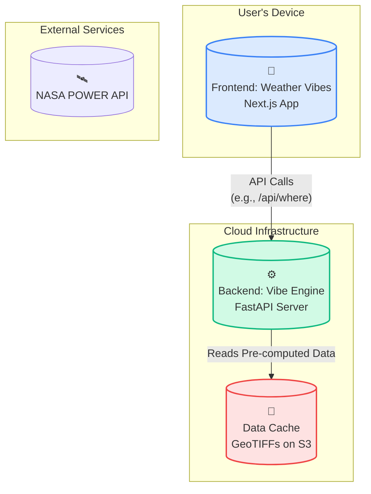
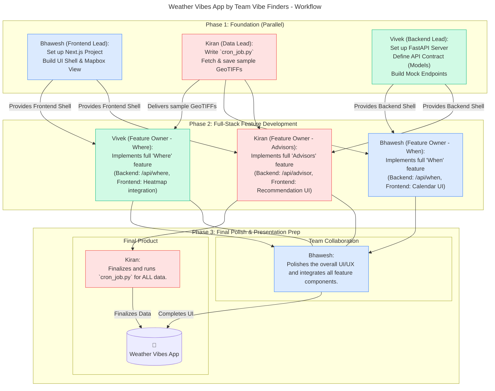

# Project Plan: Weather Vibes (by Team Vibe Finders)

This document outlines the technical design, architecture, and project plan for Weather Vibes, a theme-based weather discovery engine for the NASA Space Apps Challenge.

## 1. Team & Project Summary

**Team Name:** Vibe Finders  
**App Name:** Weather Vibes

### Team Description (for Registration):
We're Vibe Finders, and our app "Weather Vibes" helps you find the perfect weather for any activity. We translate complex NASA climate data into simple, intuitive "when" and "where" recommendations for everything from stargazing to travel, making Earth science accessible for everyone.

## 2. Vision & Core Concept

Weather Vibes is an intuitive, theme-based weather discovery engine. It closes the gap between what people want to do and when and where is the best time to do it.

Instead of asking users to interpret complex weather charts, we ask them about their desired "vibe" (e.g., "Perfect Stargazing Night," "Cozy Rainy Day for Reading," "Ideal Kite Flying Weather"). Our application then translates that human feeling into hard data, scouring decades of NASA's historical climate information to provide concrete, actionable recommendations.

## 3. Feature Breakdown & Target Personas

The project will have two core features ("Where" and "When") and one advanced feature, "Specialized Aura Advisors."

### Feature 1: "Where" - The Vibe Hotspot Finder

**Function:** Answers "Given my vibe and a time, where should I go?" by generating a heatmap of the best locations.

**Target Personas:**
- **The Travel Blogger (Anjali):** A Bangalore-based content creator who needs to find the most picturesque, misty mountain locations in South India for a monsoon-themed Instagram series in July.
- **The Event Organizer (David):** An event manager planning a 3-day music festival in February, needing a location within 200km of Bangalore with the lowest historical chance of rain.
- **The Retired Couple (The Sharmas):** They want to find a quiet town in the Western Ghats to spend the winter (Nov-Jan) where the climate is mild (18-25°C).

### Feature 2: "When" - The Vibe Calendar

**Function:** Answers "Given my vibe and a location, when should I go?" by generating a monthly "vibe score" calendar.

**Target Personas:**
- **The Hobbyist Astronomer (Rohan):** Living in Bangalore, he wants to know the best months for stargazing from his rooftop.
- **The Family Planner (The Raos):** They want to plan a weekend trip to Bandipur National Park and need to know the best month for wildlife sightings.
- **The Cafe Owner (Priya):** She wants to know which months historically have the most "cozy, rainy days" for special promotions.

### Feature 3 (Advanced): Specialized Aura Advisors

**Function:** Provides pre-configured, high-value "vibes" that offer specific recommendations beyond just a score.

**Advisors:**
- **Crop & Farming Advisor:** Predicts conditions for critical growth stages and alerts for frost, drought, or storm risks.
- **Climate Mood Predictor:** Provides personalized wellness suggestions based on the predicted "weather mood."
- **AI Fashion Stylist:** Suggests weather-appropriate outfits based on the forecast and user style preferences.

**Target Personas:**
- **The Farmer (Mr. Gowda):** A farmer near Chikkaballapur who needs optimal planting window advice and frost alerts for his tomato crop.
- **The Remote Worker (Sameer):** A developer in Bangalore wanting daily wellness prompts based on the weather "mood."
- **The Fashion Influencer (Aisha):** She wants to generate weather-appropriate outfit ideas for different Bangalore localities.

## 4. The "Vibe Engine": Core Logic In-Depth

The Vibe Engine is the brain of the application, a collection of rules and algorithms that translate vibes into data.

### The Vibe Dictionary (vibe_dictionary.json)

This backend JSON file is the central configuration for the entire application.

```json
{
  "stargazing": {
    "name": "Perfect Stargazing",
    "parameters": [
      {"id": "CLOUD_AMT", "weight": 0.6, "scoring": "low_is_better"},
      {"id": "RH2M", "weight": 0.4, "scoring": "low_is_better"}
    ]
  },
  "beach_day": {
    "name": "Ideal Beach Day",
    "parameters": [
      {"id": "ALLSKY_SFC_SW_DWN", "weight": 0.4, "scoring": "high_is_better"},
      {"id": "T2M", "weight": 0.4, "scoring": "optimal_range", "range": [24, 32]},
      {"id": "PRECTOTCORR", "weight": 0.2, "scoring": "low_is_better"}
    ]
  },
  "fashion_stylist": {
    "name": "AI Fashion Stylist",
    "type": "advisor",
    "parameters": ["T2M", "ALLSKY_SFC_SW_DWN", "PRECTOTCORR", "WS2M"],
    "logic": "fashion_rules" 
  }
}
```

### The Scoring & Recommendation Algorithm (In-Depth)

For each grid cell or location, the backend executes the following:

1. **Fetch Data:** Retrieve the pre-computed value for each required parameter from the local data cache.
2. **Normalize & Score (0-100):** This is the crucial step.

#### For low_is_better (e.g., CLOUD_AMT):
```python
# Pseudocode
def score_low(value, min_val, max_val):
  normalized = (value - min_val) / (max_val - min_val)
  return (1 - normalized) * 100
```

#### For high_is_better (e.g., ALLSKY_SFC_SW_DWN):
```python
# Pseudocode
def score_high(value, min_val, max_val):
  normalized = (value - min_val) / (max_val - min_val)
  return normalized * 100
```

#### For optimal_range (e.g., T2M for a beach day):
This uses a trapezoidal function for a smooth score.
```python
# Pseudocode
def score_range(value, optimal_min, optimal_max):
  if optimal_min <= value <= optimal_max:
    return 100
  # Add logic for graceful fall-off outside the range
  return 0 
```

#### Process Logic:
- **For standard vibes:** Calculate the weighted score: `Final Score = (Score_A * Weight_A) + (Score_B * Weight_B) + ...`
- **For "Advisors":** The logic key points to a specific function.

```python
# Pseudocode for fashion_rules
def fashion_rules(params):
  recommendations = []
  if params['T2M'] > 28 and params['ALLSKY_SFC_SW_DWN'] > 5:
    recommendations.append({"item": "Linen Shirt", "icon": "shirt"})
    recommendations.append({"item": "Sunglasses", "icon": "sunglasses"})
  if params['PRECTOTCORR'] > 5:
    recommendations.append({"item": "Waterproof Jacket", "icon": "jacket"})
  return {"type": "fashion", "recommendations": recommendations}
```

## 5. Technical Architecture

### Technical Stack
- **Frontend:** Next.js (React Framework)
- **Map Library:** Mapbox GL JS with react-map-gl
- **UI Components:** Chakra UI
- **Frontend State Management:** Zustand
- **Backend:** Python with FastAPI
- **Geospatial Libraries:** rasterio, geopandas
- **Data Store:** GeoTIFF files on a cloud storage provider (e.g., AWS S3).

### Architectural Diagram



## 6. Team Roles, Workflow & Battle Plan

This plan is structured for parallel development, with each member having a primary technical role and a full-stack feature ownership.

### Team Roles & Responsibilities

#### Kiran (Data Lead & "Advisors" Feature Owner):
- **Primary Responsibility:** Owns the complete Data Layer. This is the crucial offline task of writing, running, and managing the `cron_job.py` script to download and process all necessary data from the NASA POWER API into GeoTIFFs.
- **Full-Stack Feature:** Implements the complete "Specialized Aura Advisors." This means he will write the backend logic for the `/api/advisor` endpoint in Vivek's project and build the frontend UI components needed to display the recommendations in Bhawesh's project.

#### Bhawesh (Frontend Lead & "When" Feature Owner):
- **Primary Responsibility:** Owns the Next.js application ("the shell"). This includes project setup, UI/UX design, managing shared components (Chakra UI), and handling the core Mapbox integration.
- **Full-Stack Feature:** Implements the complete "When" feature. This involves writing the `/api/when` endpoint logic in Vivek's FastAPI project and building the corresponding frontend UI (the modal and bar chart) in his Next.js project.

#### Vivek (Backend Lead & "Where" Feature Owner):
- **Primary Responsibility:** Owns the FastAPI server ("the shell"). This includes setup, API contract definition (Pydantic models), CORS, and overall backend architecture. He is the single source of truth for the API.
- **Full-Stack Feature:** Implements the complete "Where" feature, including both the `/api/where` endpoint logic and working with Bhawesh to ensure the frontend heatmap and results are displayed correctly.

### Workflow Diagram


